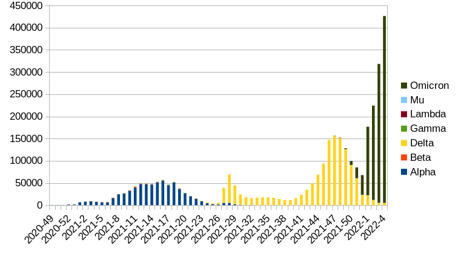

# COVID variants Netherlands

The Dutch public health service (RIVM) reports the total number of infections
fore each day, and also a weekly count of each variant based on a small
sampling study (approximately 1200 samples). However, it does not report the
estimated total number of infections for each variant.

Especially with the Omicron surge, it is impossible to tell from the reported
numbers whether other variants are increasing or decreasing.

The project seeks to remedy this issue by multiplying the weekly positive tests
with the fraction of each variant that is reported.

## Example
The output data is a simple csv file, `COVID-19_weektotaal_varianten.csv`,
which can be read with any spreadsheet program.


## Requirements
* Make
* Python3
* Wget

## Usage
```
git clone https://github.com/Redmar-van-den-Berg/covid-variants-nl

cd covid-variants-nl

make
```
